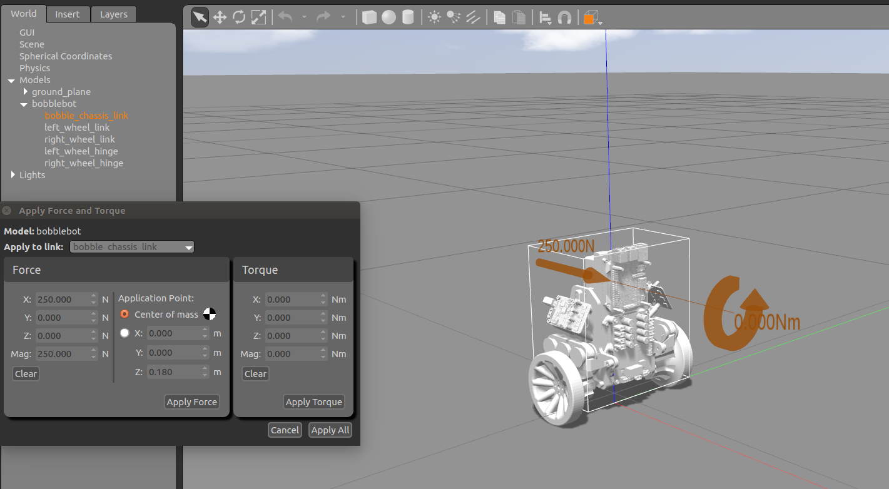

# Bobble-Bot Simulator
> A Gazebo simulation of the self-balancing ROS robot, Bobble-Bot.

<a href="http://www.youtube.com/watch?feature=player_embedded&v=hS7kfhN-8V8" 
target="_blank"></a>

Bobble-Bot is [SOE's](https://github.com/super-owesome) take on a classical problem in control theory. The robot represents 
a unique solution to the well understood problem of control of a two wheeled inverted pendulum.
The source code found in this repository constitutes the robot's balance control logic. The controller comes 
with a handy Gazebo simulation which was used extensively during the development 
of the robot. The source code is being provided as open-source software in order to help others learn about feedback 
control and the Robot Operating System (ROS).

A video of the balance controller in development.
<a href="http://www.youtube.com/watch?feature=player_embedded&v=bg6ksWbVXSk" 
target="_blank"></a>


To get started, follow the [installation instructions](#debian-install), or if you're more 
of the DIY type, [build the simulation from source](#build-from-source) 
and learn how to [build your own Bobble-Bot](#build-your-own).
 
## Debian Install

TODO debian installation package is still under development. For now, follow 
the instructions below to build from source.


## Build from source

The BobbleBot simulator requires ROS and Gazebo. Follow the instructions 
[here](http://wiki.ros.org/melodic/Installation/Ubuntu)
and install ROS Melodic Desktop. Other recent versions of ROS should also work, 
but they are not officially  supported at this time.
The simulator also makes use of the [Hector Gazebo](http://wiki.ros.org/hector_gazebo_plugins) 
plugins. Those can be installed using the command below.

```sh
apt-get install ros-melodic-hector-gazebo-plugins
```

Before starting the build process, make sure your ROS environment is active.

```sh
source /opt/ros/melodic/setup.bash
```

Get the code and build it using catkin.

```sh
mkdir -p ~/bobble_workspace/src
cd ~/bobble_workspace
catkin_init_workspace
git clone https://github.com/super-owesome/bobble_controllers.git
git clone https://github.com/super-owesome/bobble_description.git
catkin_make
```

The BobbleBot controller package comes with a set of automated tests. If you're doing development on the 
BobbleBot simulator you are expected to ensure that these tests continue to pass. To run these tests, 
use the command below.
```sh
catkin run_tests
```

The simulation should now be ready to run. Decide if you want to run using [Keyboard Control](keyoard-control) 
or [Joystick Control](joystick-control). Please create an issue if you encountered any problems performing the steps above. 

### Keyboard Control
Launch the simulation.
```sh
roslaunch bobble_controllers run_sim.launch
```

In a separate terminal (with the ROS environment sourced) launch the keyboard control node.
```sh
rosrun bobble_controllers KeyboardControl
```

The controls are summarized below. The terminal used to launch the keyboard control node must 
have the active focus.
```sh
BobbleBot Keyboard Controller
---------------------------
Activate/Deactivate command:
    Activate/Shutdown: space bar
Moving around:
    Forward : w
    Backward : s
    Left : a
    Right : d
Speed Up/Down: 
    15% Increase: q
    15% Decrease: e
CTRL-C to quit
```

### Joystick Control
The bobble_controllers package comes with a Joystick control node that is defaulted with a mapping 
that is suitable for an Xbox 1 controller. To use joystick control, follow 
[these instructions](https://www.maketecheasier.com/set-up-xbox-one-controller-ubuntu/) 
to setup your Xbox 1 controller. Next, make sure you have the [ROS joy package installed](http://wiki.ros.org/joy). 
With those two steps out of the way, you can then launch the simulator using the command below.

```sh
roslaunch bobble_controllers run_sim_with_joystick.launch
```

The default controls are depicted below:


## Docker Setup
A Bobble-Bot simulation Docker image is available over on [Docker Hub](). If you do 
not know what Docker is, we highly suggest checking it out. Docker can be used 
to quickly experiment with the simulation without polluting your system with additional 
packages. See this [page](https://docs.docker.com/get-started/) to get started.
This particular image relies on [nvidia-docker](https://github.com/NVIDIA/nvidia-docker). 
For now, an NVidia GPU is required if you want to run the graphics from within the container.

Run the simulation from within a container
```sh
git clone https://github.com/super-owesome/bobble_docker.git
cd bobble_docker
docker pull superowesome/bobble-sim:latest
./run_bobble_sim.bash
```

Enable keyboard control (in a separate terminal)
```sh
cd bobble_docker
./run_keyboard_control.bash
```

## Build Your Own

</a>

BobbleBot is a real robot built by the robotics team at SOE. Check out the 
[parts list](https://soe/bobble-parts) to learn how to build your own.

## Contributing

1. Fork [bobble_controllers](<https://github.com/super-owesome/bobble_controllers/fork>) and [bobble_description](<https://github.com/super-owesome/bobble_description/fork>)
2. Create your feature branch (`git checkout -b feature/fooBar`)
3. Commit your changes (`git commit -am 'Add some fooBar'`)
4. Ensure the tests in bobble_controllers all pass.
5. Push to the branch (`git push origin feature/fooBar`)
6. Create a new Pull Request

<!-- Markdown link & img dfn's -->
[wiki]: https://github.com/super-owesome/bobble_controllers/wiki
