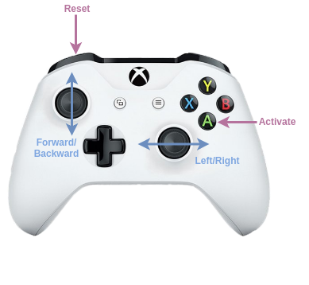
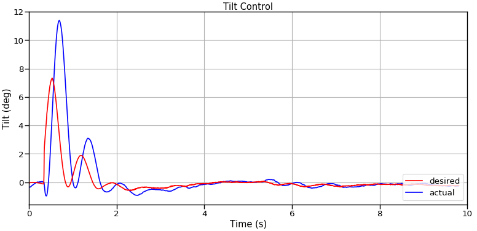
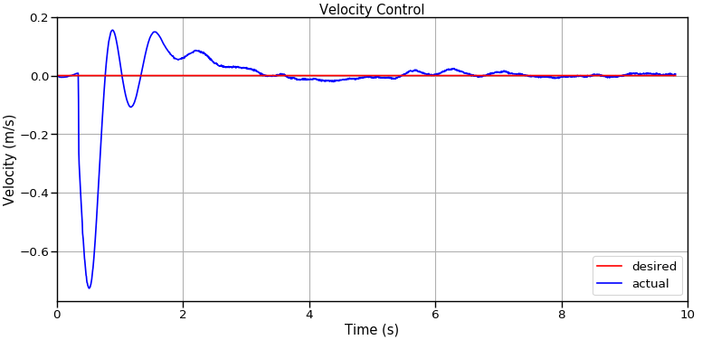
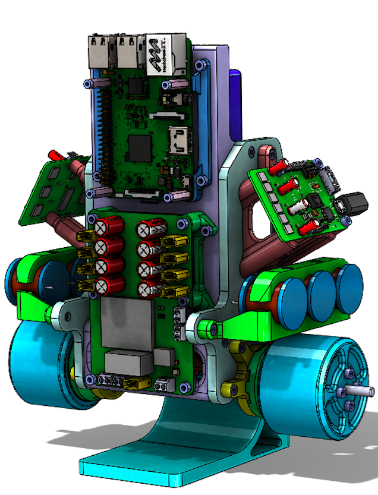

# Bobble-Bot Simulator
> A Gazebo simulation of the self-balancing ROS robot, Bobble-Bot.


Bobble-Bot is [SOE's](https://github.com/super-owesome) take on a classical problem in control theory. The robot represents 
a unique solution to the well understood problem of control of a two wheeled inverted pendulum.
The source code found in this repository constitutes the robot's balance control logic. The controller comes 
with a handy Gazebo simulation which was used extensively during the development 
of the robot. The source code is being provided as open-source software in order to help others learn about feedback 
control and the Robot Operating System (ROS).

> The real Bobble-Bot in action


To get started, follow the [installation instructions](#debian-install), or if you're more 
of the DIY type, [build the simulation from source](#build-from-source) 
and learn how to [build your own Bobble-Bot](#build-your-own).
 
## Debian Install
> Beware this section is still in development.

For now, please follow the instructions to [build the simulation from source](#build-from-source).

## Build from source

The BobbleBot simulator requires ROS and Gazebo. Follow the instructions 
[here](http://wiki.ros.org/melodic/Installation/Ubuntu)
and install ROS Melodic Desktop. Other recent versions of ROS should also work, 
but they are not officially supported at this time.
The simulator also makes use of the [Hector Gazebo](http://wiki.ros.org/hector_gazebo_plugins) 
plugins. Those can be installed using the command below.

```sh
apt-get install ros-melodic-hector-gazebo-plugins
```

The bobble_description repository contains some large mesh files. To check these out 
properly we need git lfs installed. Follow the steps below to install git lfs.

```sh
echo 'deb http://http.debian.net/debian wheezy-backports main' > /etc/apt/sources.list.d/wheezy-backports-main.list
curl -s https://packagecloud.io/install/repositories/github/git-lfs/script.deb.sh | bash
apt-get install -q -y git-lfs
git lfs install
```


Before starting the build process, make sure your ROS environment is active.

```sh
source /opt/ros/melodic/setup.bash
```

Get the code and build it using catkin.

```sh
mkdir -p ~/bobble_workspace/src
cd ~/bobble_workspace/src
catkin_init_workspace
git clone https://github.com/super-owesome/bobble_controllers.git
git clone https://github.com/super-owesome/bobble_description.git
cd .. ; catkin_make
source devel/setup.bash
```

The BobbleBot controller package comes with a set of automated tests. If you're doing development on the 
BobbleBot simulator you are expected to ensure that these tests continue to pass. To run these tests, 
use the command below.

```sh
catkin_make run_tests_bobble_controllers -j1
```

The simulation should now be ready to run. Decide if you want to run using [Keyboard Control](keyoard-control) 
or [Joystick Control](joystick-control). Please create an issue if you encountered any problems performing the steps above. 

### Keyboard Control
Launch the simulation.

```sh
roslaunch bobble_controllers run_sim.launch
```

In a separate terminal (with the ROS environment sourced) launch the keyboard control node.

```sh
source devel/setup.bash
rosrun bobble_controllers KeyboardControl
```

The controls are summarized below. The terminal used to launch the keyboard control node must 
have the active focus. Hit space-bar to activate the balance controller.

```sh
BobbleBot Keyboard Controller
---------------------------
Activate/Deactivate command:
    Activate/Shutdown: space bar
Moving around:
    Forward : w
    Backward : s
    Left : a
    Right : d
Speed Up/Down: 
    15% Increase: q
    15% Decrease: e
CTRL-C to quit
```

### Joystick Control
The bobble_controllers package comes with a Joystick control node that is defaulted with a mapping 
that is suitable for an Xbox 1 controller. To use joystick control, follow 
[these instructions](https://www.maketecheasier.com/set-up-xbox-one-controller-ubuntu/) 
to setup your Xbox 1 controller. Next, make sure you have the [ROS joy package installed](http://wiki.ros.org/joy). 
With those two steps out of the way, you can then launch the simulator using the command below.

```sh
source devel/setup.bash
roslaunch bobble_controllers run_sim_with_joystick.launch
```

The default controls are depicted below:




## Analyzing Simulation Data
This repository also comes with some sample Python scripts and [Jupyter notebooks](https://jupyter.org/) 
that show how to use [Pandas](https://pandas.pydata.org/) to analyze output data 
from the simulation. Using the [gazebo-ros](https://github.com/ros-simulation/gazebo_ros_pkgs) 
packages, one can log data as the simulator runs and store it in a ROS bag format. 
The steps below provide an example of how this is done.

First, we need to generate some data to analyze. The "apply_impulse_force" launch file 
is a good one to start with. Let's apply an impulse to Bobble-Bot in the -X direction 
and see how the balance controller holds up. 

```sh
source devel/setup.bash
roslaunch bobble_controllers apply_impulse_force.launch impulse:=-1000 out_file:=~/bobble_workspace/src/bobble_controllers/analysis/impulse_test
```

If all goes well, the Gazebo simulation should launch and you should see Bobble-Bot hold 
its balance in spite of the applied impulse. After the test completes, you should see a 
newly created impulse_test.bag file in the bobble_controllers/analysis directory. Let's 
analyze the data in this bag file.

```sh
cd src/bobble_controllers/analysis
python make_plots.py --run impulse_test.bag
```

The script above uses the analysis_tools Python module defined in this repository to 
load the data and make the plots. After running the make_plots.py script above, you 
should see that two images were created: 'TiltControl.png' & 'VelocityControl.png'. 
They should look something like the following:




Try changing the gains in config/bobble_sim_balance_control.yaml and then repeating 
the steps above to generate and analyze new data. Testing and analyzing your changes 
against an applied impulse force is a good practice. The apply impulse launch file 
and analysis_tools module are part of the automated tests that are run against the 
bobble_controllers ROS package. This is how we ensure the controller remains in 
a working state.

## Docker Setup

A Bobble-Bot simulation Docker image is available over on 
[Docker Hub](https://cloud.docker.com/u/superowesome/repository/docker/superowesome/bobble-sim). 
If you do not know what Docker is, we highly suggest checking it out. Docker can be used 
to quickly experiment with the simulation without polluting your system with additional 
packages. See this [page](https://docs.docker.com/get-started/) to get started.
This particular image relies on [nvidia-docker2](https://github.com/NVIDIA/nvidia-docker). 
For now, an NVidia GPU is required if you want to run the graphics from within the container. 
If you only care about running the simulation headless (no graphics), then Docker is the 
only requirement.

Run the simulation with graphics from within a container (master branch version of sim).

```sh
docker pull superowesome/bobble-sim:latest
cd ~/bobble_workspace/src
git clone https://github.com/super-owesome/bobble_docker.git
cd bobble_docker
./run_bobble_sim.bash
```

Enable keyboard control (in a separate terminal).

```sh
./run_keyboard_control.bash
```

Run the simulation headless from within a container (master branch version of sim).

```sh
./run_apply_impulse.bash
```

Note that the run_apply_impulse.bash script mounts the bobble_docker folder into the 
container and then directs the apply_impulse launch file to write the output data 
to that folder. This is a useful script for generating some sample data for analysis.

Use the bash script below to launch a container intended for building the simulation 
from source. This is a useful container for development.

```sh
./run_dev_container.bash
```

This container mounts the bobble_workspace folder in your host 
machine's home directory to /bobble_src in the container and then gives 
the user an interactive bash shell. This shell can then be used to build and run 
the simulation from within a container. We recommended that you use your favorite 
desktop editor to make code modifications, and then just use the container to build 
and launch the simulation. Execute commands like the following inside the container 
to rebuild the sim from source and run it.

```sh
cd /bobble_src
catkin config --install
catkin init
catkin build
source install/setup.bash
roslaunch bobble_controllers apply_impulse_force.launch
```

You can now freely edit the files on your host machine and simply re-run catkin 
build and roslaunch commands at will.


## Build Your Own
> Beware this section is still in development.

</a>

BobbleBot is a real robot built by the robotics team at SOE. Check out the 
[parts list](https://soe/bobble-parts) to learn how to build your own.

Here's a video of the original balance controller in development.
<a href="http://www.youtube.com/watch?feature=player_embedded&v=bg6ksWbVXSk" 
target="_blank"></a>

## Contributing

1. Fork [bobble_controllers](<https://github.com/super-owesome/bobble_controllers/fork>) and [bobble_description](<https://github.com/super-owesome/bobble_description/fork>)
2. Create your feature branch (`git checkout -b feature/fooBar`)
3. Commit your changes (`git commit -am 'Add some fooBar'`)
4. Ensure the tests in bobble_controllers all pass.
5. Push to the branch (`git push origin feature/fooBar`)
6. Create a new Pull Request

<!-- Markdown link & img dfn's -->
[wiki]: https://github.com/super-owesome/bobble_controllers/wiki
